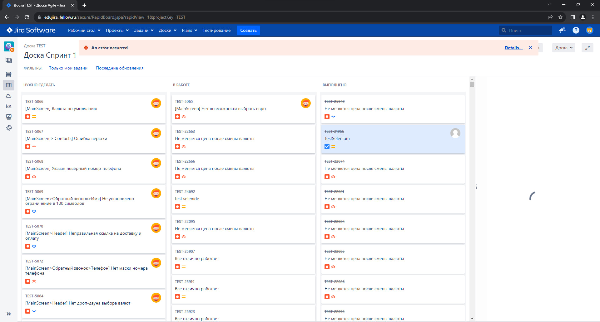
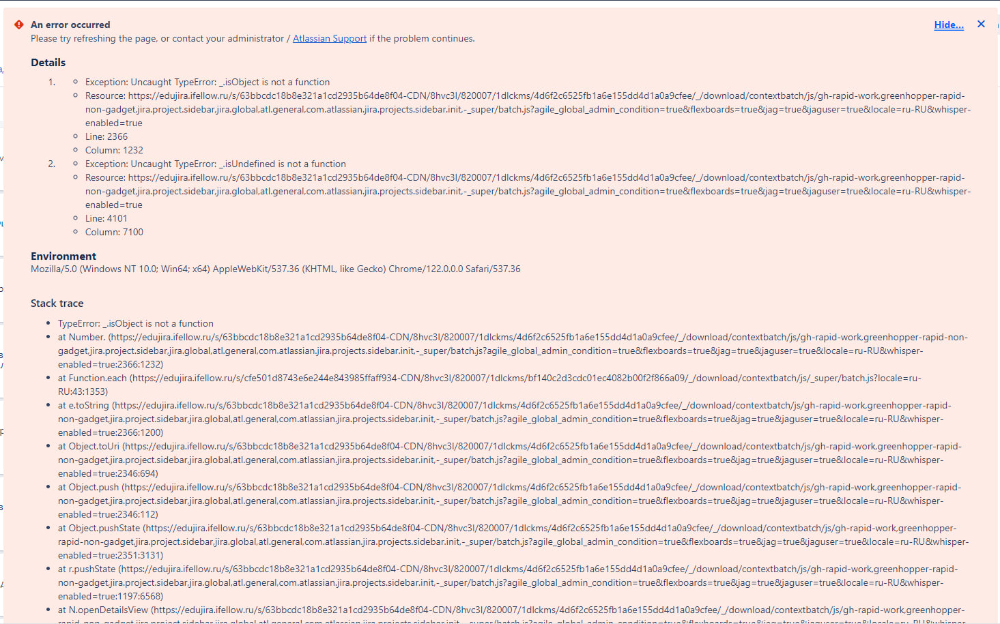

# Репозиторий для домашних заданий из академии iFellow

## Задание №6
### Список тестов:
1. Файлы [**SprintsPage**](src/main/java/ru/iFellow/pages/SprintsPage.java)/[**SprintsPageTest**](src/test/java/pages/SprintsPageTest.java).
   1. Проверка статуса задачи TestSelenium.
   2. Проверка значения в поле "Исправить в версиях".
2. Файлы [**TasksPage**](src/main/java/ru/iFellow/pages/TasksPage.java)/[**TasksPageTest**](src/test/java/pages/TasksPageTest.java).
   1. Поверка создания новой задачи.
      1. Получение количества задач.
      2. Создание новой темы.
      3. Получение нового количества задач.
      4. Сравнение количества до и после создания.
3. Файлы [**TasksCreatedByMePage**](src/main/java/ru/iFellow/pages/TasksCreatedByMePage.java)/[**TasksCreatedByMePageTest**](src/test/java/pages/TasksCreatedByMePageTest.java).
    1. Открытие последней созданной мной задачи.
   2. Прогон по основным состояниям: Сделать, В работе, Исполнено, Готово.
   
-----

### Отличия от третьего задания
Отличий, на самом деле, очень мало. 
1. Добавил имена переменным, чтобы в отчёте отображалось красиво.
2. Добавил наследника AllureSelenide, чтобы в отчёт добавлялись скриншоты.
3. Перенес шаги из тестовых классов.
4. Раскидал всё по папкам

-------

Пришлось поменять версию aspectj, чтобы работало с аннотацией Step. Так же стоит объяснить причины, по которым используются ссылки, а не переходы по кнопкам со стартовой страницы: У меня не прогружалась Jira и вылезала ошибка.

